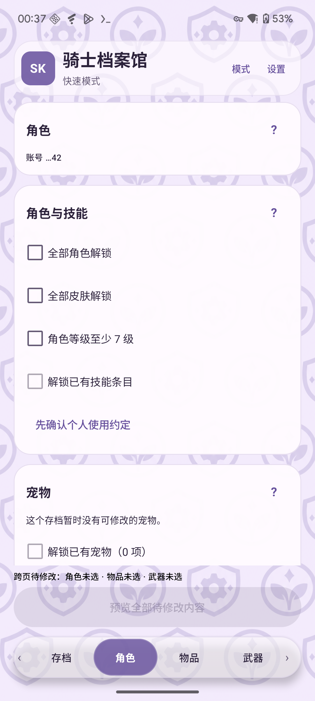
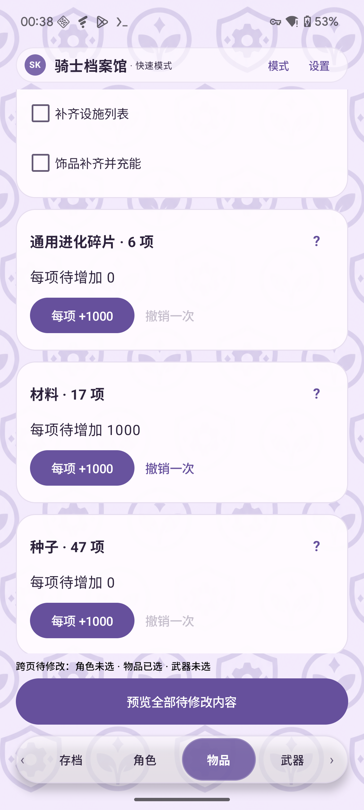
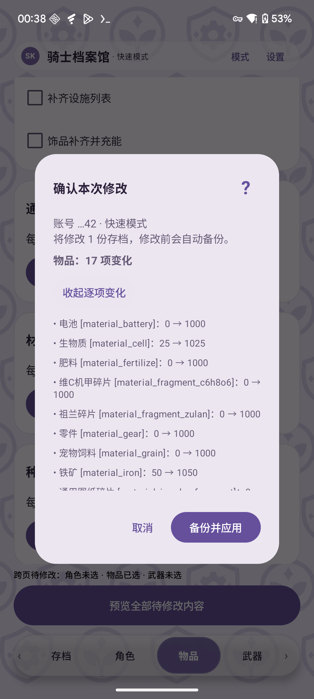

# 骑士档案馆 · 元气骑士本地存档工具

在自己的 Android 设备上读取元气骑士本地存档，选择角色、皮肤、物品或武器获取次数的修改，先看预览，再备份并应用。提供批量操作的**快速模式**，也提供按名称搜索、逐项选择的**专家模式**。

**[下载 Android 2.0.2 APK](https://github.com/Show-o4210/Soul-Knight-Save-Editor/releases/download/v2.0.2/SoulKnightSaveEditor-2.0.2.apk)** · **[第一次使用：图文教学](docs/help/getting-started.md)** · **[帮助中心](docs/help/README.md)**

适用于 **Android 7.0 及以上、已 Root 的设备**。默认使用原生 Root，也可选择通过 Root 启动的 Shizuku。当前存档适配基准为**元气骑士 8.6.0**，其他版本、渠道与机型需要分别验证。

## 可以做什么

| 想做的事 | 操作例子 |
| --- | --- |
| 角色与皮肤解锁 | 快速模式选择全部现有角色／皮肤；专家模式只选自己需要的条目 |
| 等级、技能与宠物 | 将现有角色升到至少 7 级，保留更高等级；解锁存档中已有的技能、宠物条目 |
| 增加材料、种子等数量 | 在“材料”点一次“每项 +1000”：生物质 25 → 1025；专家模式可以只改生物质 |
| 调整小鱼干与试玩券 | 输入目标数量，例如小鱼干当前 5、输入 20，预览为 5 → 20；留空不改 |
| 磁带、蓝图、设施与饰品 | 磁带数量设为 1、蓝图研究、补齐设施、饰品补齐并充能 |
| 武器获取次数 | 快速模式全部 +8；专家模式搜索武器并单独增加次数。特殊武器的其他资格仍由游戏判断 |
| 留存修改前的原件 | 手动导出本地存档 ZIP；应用修改前自动备份，可查看、导出或恢复该次修改的原件 |

  
  
  

截图中的账号、数值是演示数据，用来展示界面和操作方式。各项要求与限制见[功能说明](docs/help/features.md)；截图不代表这些修改已通过游戏内验证。

## 怎么开始

1. 下载上面的 **APK** 并安装。Release 提供已打包的安装文件，直接使用无需配置开发环境；“Source code”压缩包是源码。
2. 进入快速模式，在 Root 管理器中为助手授权；到“存档”页选择游戏版本，点“读取存档”。多个账号时，再选择目标账号。
3. 到“设置 → 备份与恢复”选择助手以外的文件夹，先“备份当前本地存档”。
4. 在角色／物品／武器页勾选或输入，点“预览全部待修改内容”，核对后再点“备份并应用”。
5. 查看操作结果，再进入游戏核对实际进度。读取、刷新和应用修改会关闭所选游戏，请先退出游戏。

不确定按钮作用时，从[图文教学](docs/help/getting-started.md)开始。找不到存档、按钮不可用或修改未生效时，看[常见问题](docs/help/troubleshooting.md)。旧 alpha／Debug 包与正式包签名不同，更新前先看[备份与安装更新](docs/help/backup-and-update.md)。

## 测试到什么程度

**文件修改／读写最近测试时间：2026-10-09。** Pixel 6 / Android 16 上的原生 Root 与 Shizuku Root 通道通过了合成文件读写、备份与事务恢复检查；本轮没有修改真实游戏存档，也没有验证游戏内效果。此前 vivo 8.6.0 有角色、皮肤解锁的用户实测反馈。

**不保证实际可用。** 上述记录不能代表全部功能、机型、Root 管理器、游戏版本或渠道兼容；OnePlus / APatch 等反馈环境仍待用户复测。详细范围见[验证记录](docs/root-shizuku-validation.md)和[开发状态](docs/development-status.md)。当前正式版为 **2.0.2**，变更见[发布说明](docs/releases/2.0.2.md)。

## 文档与反馈

| 你需要什么 | 入口 |
| --- | --- |
| 了解功能、按钮、备份与问题排查 | [用户帮助](docs/help/README.md) |
| `.data`、`.data.new`、本地读取开关与云存档同步 | [本地读取说明](docs/help/local-data-reading.md) |
| 构建、实现规则、测试与历史开发记录 | [开发文档](docs/development/README.md) |
| 使用原有 Python 桌面版 | [Python 说明](desktop/README.md)（功能与 Android 分别维护） |
| 查看版本或反馈问题 | [Releases](https://github.com/Show-o4210/Soul-Knight-Save-Editor/releases) · [Issues](https://github.com/Show-o4210/Soul-Knight-Save-Editor/issues) |

反馈时请说明助手版本、游戏版本／渠道、设备和 Root 方式、具体按钮及提示；存档与账号信息请勿公开上传。反馈示例见[常见问题](docs/help/troubleshooting.md)。

应用在本地运行，没有联网权限，不代替游戏登录或云存档功能。仅处理自己有权操作的文件。本项目与凉屋游戏无关，操作前请保留可恢复的原始存档。
