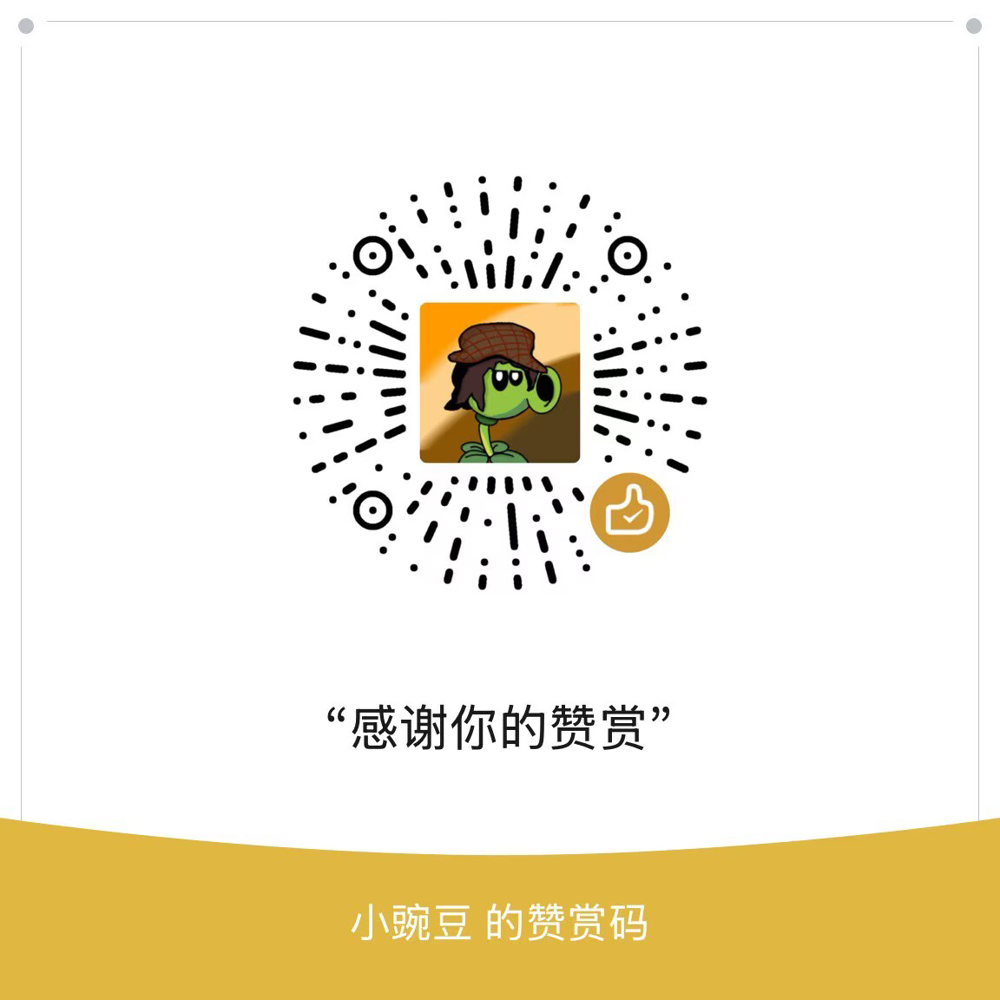

# 元气骑士存档编辑器（Soul Knight Save Editor）

<p align="center">
  
</p>
<p align="center">如果这个项目对你有所帮助，欢迎扫码赞赏支持。</p>

一套面向《元气骑士》Android 本地离线存档的图形化编辑与增量合并工具，同时提供 **Android 客户端**与 **Python 桌面客户端**。两端针对各自平台采用不同的交互和部署方式，但都支持常见存档分片、PlayerPrefs、材料、角色、武器记录及进化数据等内容的编辑。

> [!WARNING]
> 修改存档可能造成进度损坏、云存档冲突或账号异常。操作前请退出游戏、确认云存档已上传，并务必保留未经修改的原始备份。本项目与凉屋游戏无关，请仅操作自己拥有的存档。

## 版本选择

| 版本 | 适用场景 | 技术栈 | 存档读写方式 |
| --- | --- | --- | --- |
| **Android 版** | 希望直接在手机上编辑；Root 设备需要自动读取和安全回写 | Kotlin、Jetpack Compose、Material 3 | Root 自动读写，或非 Root 手动导入/导出 ZIP |
| **Python 桌面版** | 希望在 Windows、Linux 或 macOS 上使用桌面 GUI | Python 3.8+、PySide6 | 手动将手机存档复制到 `输入/`，结果生成到 `输出/` |

## 主要功能

- 编辑角色及等级、技能、皮肤、宠物、材料、种子、蓝图、物品、花圃植物、客厅设施、秘密钥匙、武器获取次数及锻造解锁等内容。
- 使用参考存档补齐缺失的物品、武器进化和武器记录，已有值不会被覆盖。
- 修改前预览涉及的文件和内容，生成后重新解码校验。
- 识别常见 `.data` 分片与 PlayerPrefs XML，无法识别或解码的文件不会被盲目改写。
- Android 版支持 ZIP 完整性清单、本地备份恢复及 Root 安全回写；桌面版采用输入、输出目录隔离，避免污染源文件。

## 存档位置与支持的文件

当前代码针对游戏包名 `com.ChillyRoom.DungeonShooter`。Android 设备上的主要存档路径为：

| 类型 | 路径 | 常见文件 |
| --- | --- | --- |
| `.data` 分片 | `/data/data/com.ChillyRoom.DungeonShooter/files/` | `game.data`、`item_data_<UID>_.data`、`statistic_<UID>_.data` 等 |
| PlayerPrefs | `/data/data/com.ChillyRoom.DungeonShooter/shared_prefs/` | `com.ChillyRoom.DungeonShooter.v2.playerprefs.xml` 或名称类似的 `*playerprefs*.xml` |

支持识别的常见存档包括：

- `game.data`
- `item_data_<UID>_.data`
- `statistic_<UID>_.data`
- `weapon_evolution_data_<UID>_.data`
- `setting_<UID>_.data`
- `bp_data_<UID>_.data`
- `misc_data_<UID>_.data`
- `season_data_<UID>_.data`
- `pvp_data_<UID>_.data`
- `com.ChillyRoom.DungeonShooter.v2.playerprefs.xml`

> 访问游戏私有目录通常需要 Root、备份工具或具备相应权限的文件管理器。请勿混用不同账号 UID 的分片。缺少 `game.data` 或 PlayerPrefs 时，部分功能仍可使用，但会受当前已导入分片的限制。

---

## Android 版

### 运行要求

- Android 7.0（API 24）或更高版本。
- Root 自动读取和直接回写需要设备已取得 Root 权限，并由 Root 管理器向本应用授权。
- 无 Root 权限时仍可手动导入、编辑、备份和导出，但需要自行取得并放回游戏存档。

### Root 模式

1. 安装并启动应用，阅读风险提示后继续。
2. 在 Root 管理器中授权，应用会扫描游戏私有目录并加载存档。
3. 进入“编辑”，选择需要修改的项目。
4. 生成修改预览，核对目标 UID、修改内容及涉及文件。
5. 确认游戏已经退出，再执行 Root 写回。应用会先备份，再写入并校验；失败时会尝试自动回滚。
6. 启动游戏检查结果，确认无误前不要删除备份。

### 手动模式（非 Root）

1. 在“设置”中关闭 Root 高级模式。
2. 在“工作区”选择同一账号的多个存档分片，或导入此前导出的 ZIP。
3. 完成编辑并核对修改预览。
4. 导出 ZIP；包内包含存档文件、UID 信息及 SHA-256 完整性清单。
5. 备份游戏原文件，解压 ZIP，再将修改后的存档放回对应目录。请保留原文件权限和属主。

### 构建与测试

构建环境：Android Studio（支持 AGP 9.3）、Android SDK 36、JDK 21。

在项目根目录执行：

```powershell
# Windows：运行 JVM 单元测试并构建 Debug APK
.\gradlew.bat testDebugUnitTest assembleDebug
```

```bash
# Linux/macOS
./gradlew testDebugUnitTest assembleDebug
```

Debug APK 输出到：

```text
app/build/outputs/apk/debug/app-debug.apk
```

连接已启用 USB 调试的设备或启动模拟器后，可运行设备测试：

```powershell
.\gradlew.bat connectedDebugAndroidTest
```

> Root 破坏性设备测试只应在专用测试设备上执行。

### Android 版安全设计

- ZIP 最多包含 64 个文件，单文件不超过 16 MiB，总解压大小不超过 64 MiB，并阻止路径穿越及重复文件名。
- 一个工作区只允许一个 UID，避免不同账号的分片混用。
- 每次修改都会重新编码、重新解码，并生成修改前后的 SHA-256 摘要。
- 本地备份通过清单记录文件大小和 SHA-256，恢复前会再次验证。
- Root 回写前重新读取实际目标并核对 UID/哈希，通过临时文件原子替换，完成后再次校验；失败时尝试回滚。
- Android 系统备份已关闭，降低敏感存档被系统备份机制意外带出的风险。
- 云同步兼容修复仅在用户明确确认后，备份并清理遗留的 `*.data.new` 与 PlayerPrefs 文件。

---

## Python 桌面版

### 安装与启动

确保已安装 Python 3.8+，进入 Python 桌面版目录后执行：

```bash
pip install -r requirements.txt
python run.py
```

运行依赖仅包含 **PySide6** 与 **pycryptodome**。XOR + DES 加解密已内置于 `core/crypto.py`，不依赖 `soul-knight-data-processing` 或 UnityPy，便于使用 PyInstaller 等工具打包。

### 准备输入文件

将从手机取得的文件放入 `输入/`：

- **基础文件**
  - `game.data`
  - `com.ChillyRoom.DungeonShooter.v2.playerprefs.xml`（名称类似的 PlayerPrefs XML 也可）
- **按修改目标添加**
  - `item_data_<UID>_.data`：花圃、材料、种子、蓝图及神话武器等。
  - `setting_<UID>_.data`：修改物品且需要同步 Legacy 开关时。
  - `weapon_evolution_data_<UID>_.data`：武器进化等级合并。
  - `statistic_<UID>_.data`：地牢武器获取次数或常规武器锻造解锁。

请勿放入无关日志、无需修改的分片、不同 UID 的文件，或无 UID 区分的冗余副本（例如 `item_data.data`）。GUI 的设置页、工作台及“输入不完整”提示会说明缺少的文件及其手机路径。

### 使用参考存档

仅在需要增量参考合并（Union Merge）时使用 `参考/`。将参考账号的 PlayerPrefs XML 与对应 UID 的分片放入该目录。合并只补充目标账号缺少的条目，不覆盖已有进度。

### 应用修改与部署

在 GUI 中点击“应用并输出”后：

1. `输出/` 会被清空并重新生成。
2. 仅输出本次修改或合并所触及的加密分片。
3. 同时生成 `部署说明.json` 和 `changes_preview.json`，用于核对部署步骤与变更。
4. 将 `.data` 文件写回游戏的 `files/`，将 XML 写回 `shared_prefs/`。

### 回归测试

```bash
python -Xutf8 tests/accept_crypto_parity.py
python -Xutf8 tests/test_crypto_pure.py
python -Xutf8 tests/test_v2.py
python -Xutf8 tests/test_v3.py
```

### Python 版安全设计

- `输入/` 仅作为只读来源，所有结果写入 `输出/`。
- 参考存档采用增量合并，不覆盖目标存档已有项目。
- 修改物品分片时自动同步 Legacy 相关开关，并设置 `OpenRijTest=0`。
- PlayerPrefs 中角色和宠物解锁的布尔值会标准化为 `True`/`False`，匹配 Unity PlayerPrefs 的存储格式。

---

## 项目结构

```text
.
├─ app/
│  ├─ src/main/java/.../
│  │  ├─ MainActivity.kt       # Android Compose 界面与应用流程
│  │  ├─ core/                 # 导入、编解码、修改、备份及 Root 回写
│  │  └─ ui/theme/             # Material 3 主题
│  ├─ src/test/                # JVM 单元测试
│  └─ src/androidTest/         # Android/Root 设备测试
├─ Agent/Soul-Knight-Save-Editor/
│  ├─ run.py                   # Python 桌面版入口
│  ├─ core/、engine/、gui/     # 核心逻辑、补丁引擎与 PySide6 界面
│  ├─ 输入/、参考/、输出/      # 桌面版工作目录
│  └─ tests/                   # Python 回归与验收测试
├─ gradle/                     # Gradle Wrapper 与版本目录
└─ settings.gradle.kts
```

## 开发说明

新增或调整存档字段时，建议同步完成以下工作：

1. 在分片注册表和编解码层确认文件名、UID 与算法。
2. 通过补丁计划表达修改意图，并在补丁引擎中实现最小范围变更。
3. 保持修改预览、重新解码校验和写回前校验完整。
4. 为正常输入、损坏输入、跨 UID、ZIP 安全和回滚路径补充测试。

## 常见问题

**没有 Root 可以使用吗？**  
可以。Android 版关闭 Root 模式后可手动导入和导出；也可以在电脑上使用 Python 桌面版。两种方式都需要自行取得并放回游戏存档。

**为什么某些编辑项不可用？**  
通常是对应存档分片缺失、文件无法解码，或当前工作区没有可识别的 UID。请按界面提示补充同一账号的存档文件。

**Android 版导出的 ZIP 可以直接刷入吗？**  
ZIP 是便于校验和传输的备份包。手动部署时应先解压，再将其中的存档文件放回正确目录，并保留原文件权限和属主；Root 模式会自动完成这些操作。

**参考存档同步会覆盖已有进度吗？**  
不会。两端均采用增量补全，只添加目标存档缺少的可同步条目。

## 免责声明

本工具仅供存档研究、个人备份和学习交流。游戏更新可能随时改变存档格式，任何版本都无法保证绝对兼容。使用者应自行承担存档损坏、进度丢失、云同步冲突及账号风险。
