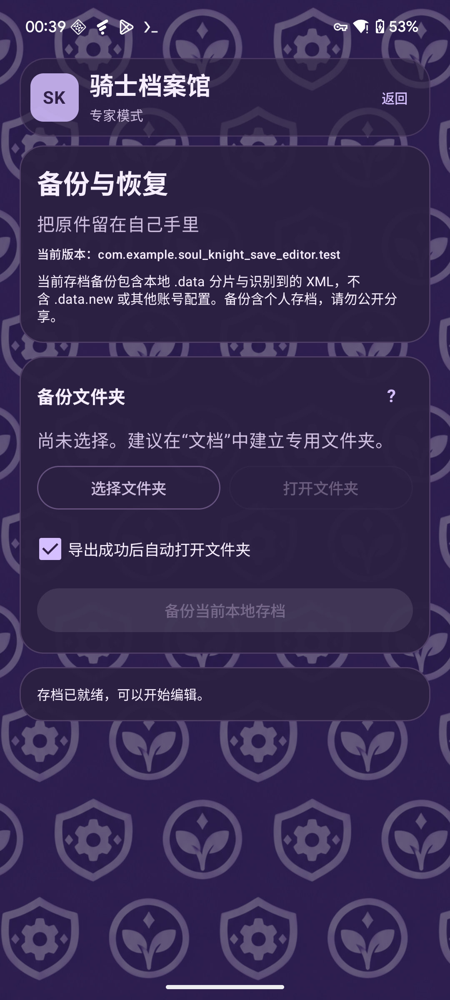

# 备份与安装更新

[帮助中心](README.md) · [图文教学](getting-started.md)

## 两种备份，用途不同

| 备份 | 怎么获得 | 能怎么用 |
| --- | --- | --- |
| 手动本地存档 ZIP | 设置 → 备份与恢复 → 选择文件夹 → 备份当前本地存档 | 在外部文件夹留存本次识别到的 `.data` 分片和 XML；目前不能导入助手整包恢复 |
| 自动修改原件 | 每次“备份并应用”前由助手保存 | 在备份列表查看该次修改，导出备份包／原件，或用“恢复原件”还原该次修改涉及的文件 |

“打开文件夹”用于查看导出位置；“更换目录”重新选择位置。自动备份保存于助手内部，**卸载助手会删除内部备份、设置与草稿**；请用“导出此备份包”或“导出原件”把需要保留的内容留在外部。

这两种备份都不是完整游戏应用备份。助手不包含 `.data.new` 或其他账号配置；需要排查读取来源或迁移完整进度时，应另外保存实际游戏目录的完整原件，见[本地读取说明](local-data-reading.md)。备份包含个人存档，不要公开分享。

## 恢复按钮

- **恢复原件**：恢复这次自动备份对应的原始文件，会关闭目标游戏；不是导入任意 ZIP，也不恢复游戏所有数据。
- **恢复未完成事务**：仅在有未完成写回时出现，先按提示使用原访问方式恢复，再继续编辑。
- 如果游戏后来改写了文件，助手可能因检测到后续变化而拒绝恢复。先保留当前进度和原件，查看提示，不要反复强行覆盖。

恢复完成后，进入游戏确认进度。文件恢复检查通过不等于游戏一定选用了这份存档。

## 安装正式版

从[官方 Releases](https://github.com/Show-o4210/Soul-Knight-Save-Editor/releases)下载 `.apk` 文件，在 Android 上安装，再为助手授权 Root。“Source code”是源码，不能直接作为 Android 安装包使用。Release 的好处是可以直接安装；需要自行构建的开发者看[构建文档](../development/README.md)。

当前正式包是 **2.0.2 / versionCode 18**，原生 Root 默认，Shizuku Root 可选；选择 Shizuku 不会免除 Root 要求。安装后先尝试读取，再看功能是否可用。

## 更新已有安装

| 原来的版本 | 更新方式 |
| --- | --- |
| 正式签名 2.0.0／2.0.1-rc01 | 可覆盖安装同包名、同正式签名且更高 versionCode 的 2.0.2 |
| 早期 alpha／Debug／2.0.2-root01 | 与正式包签名不同，不能直接覆盖；按下面步骤迁移 |

迁移步骤：

1. 在旧助手中处理未完成事务，导出所有需要保留的备份和原件。
2. 确认文件已经保存在**助手以外**，并另外保留自己的游戏原始存档。
3. 卸载旧助手，安装正式 APK，重新授权 Root 并选择游戏。
4. 重新读取并检查。导出的 ZIP 目前不能导回助手的自动恢复列表。

“签名不一致”不是游戏存档格式问题，不要因此先卸载游戏。正式发布标签 `v1` 对应 Android 2.0.0 里程碑；旧 Python `v1.0.1` 是另一客户端。[历史版本与迁移记录](../releases/2.0.0.md)保留详细信息。需要校验下载文件时，发布附件提供 `SHA256SUMS.txt` 和公开签名证书，构建与证书说明见[签名文档](../android-signing.md)。

**文件修改测试时间：2026-10-09。** 当前合成文件验证不能保证你的设备和游戏实际可用，具体边界见[2.0.2 发布说明](../releases/2.0.2.md)。
