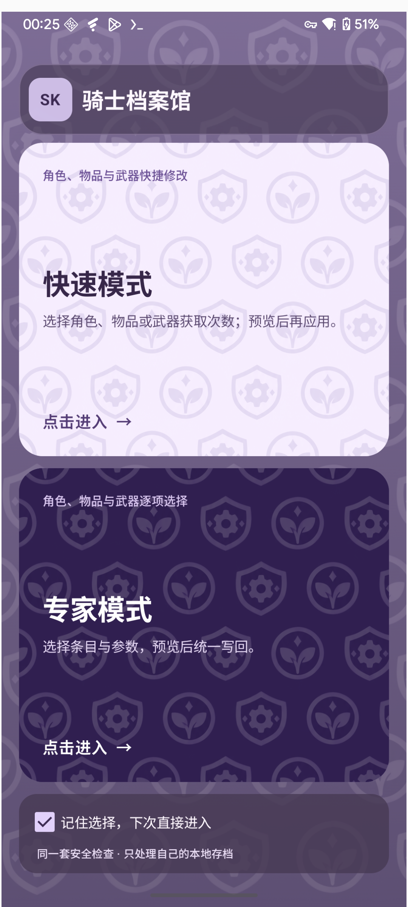
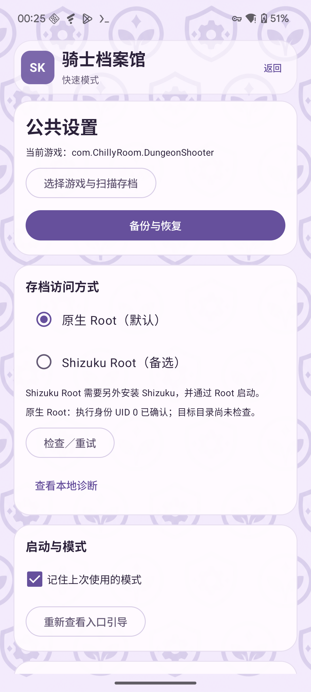
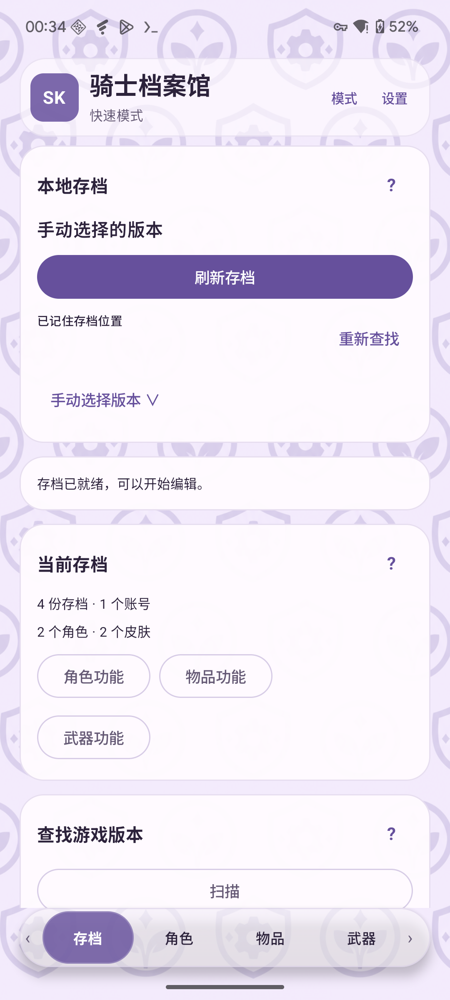
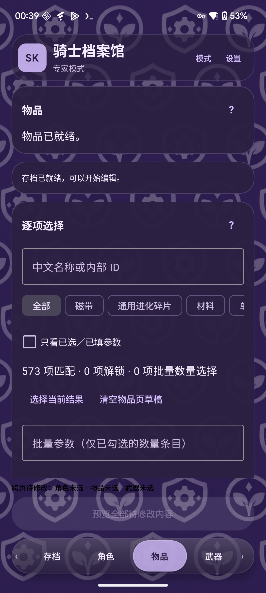

# 第一次使用：看图认识按钮

[帮助中心](README.md) · [功能说明](features.md) · [备份与更新](backup-and-update.md)

这篇以 Android 2.0.2 为例。先准备已 Root 的 Android 设备、自己的本地存档和可保存备份的文件夹。配图中的数值来自独立演示文件，截图只说明界面，**不保证实际游戏可用**。

## 1. 安装并选择模式

从[发布页](https://github.com/Show-o4210/Soul-Knight-Save-Editor/releases/tag/v2.0.2)下载 `SoulKnightSaveEditor-2.0.2.apk`，安装后打开“骑士档案馆”。首次弹出个人本地存档使用确认，阅读后按自己的意愿选择；尚未同意时写入和预览按钮不可用。

| 按钮／选项 | 有什么用 |
| --- | --- |
| 快速模式 | 按类别准备批量修改，适合先认识功能 |
| 专家模式 | 搜索名称或内部 ID，只选择需要的条目和数量 |
| 记住选择，下次直接进入 | 下次打开跳过模式入口；仍可从页面上方“模式”切换 |
| 模式／设置 | “模式”回到上图；“设置”进入访问权限与备份入口 |
| 卡片右上角“？” | 查看当前功能说明和限制 |

## 2. 授权并读取存档

默认使用原生 Root。Root 管理器弹窗时为“骑士档案馆”授权；没看到弹窗，可以去管理器的超级用户列表检查。需要备选方式时，在“设置 → 存档访问方式”选择 Shizuku Root，另行安装 Shizuku、**通过 Root 启动**，再点“授权 Shizuku”与“检查／重试”。Shizuku 的 ADB 模式不能满足这里的私有存档访问要求。

  
  

| 存档页按钮 | 有什么用 |
| --- | --- |
| 读取存档 | 读取已选游戏的本地文件；会关闭该游戏 |
| 刷新存档 | 已读取后，沿记住的位置重新读取最新内容；会关闭该游戏，并清空旧草稿 |
| 重新查找 | 重新寻找当前游戏的存档位置，找不到旧路径时使用 |
| 查找游戏版本 → 扫描 | 只读查找已安装游戏的存档特征，列出候选；这个查找按钮不会关闭游戏 |
| 选择这个版本 | 将候选设为目标，随后点“读取存档” |
| 手动选择版本 | 展开包名输入；确认实际渠道包名后点“使用这个版本”，再读取 |
| 账号选择 | 多账号时指定一个目标；只有一个账号时自动选中 |
| 角色功能／物品功能／武器功能 | 跳到对应页面，也可点底部标签切换 |

上图是**读取成功后**，主按钮已变成“刷新存档”。看到“存档已就绪”后再开始编辑；某类文件缺失时，其余能识别的功能可能仍可用。切换游戏、账号或访问方式后，要重新读取，旧草稿不会沿用。权限身份检查通过，也不代表已经找到游戏存档。

## 3. 先把原件保存到外部

进入“设置 → 备份与恢复”，点“选择文件夹”，在系统文件选择器中选一个自己能找到的位置，再点“备份当前本地存档”。“打开文件夹”用于查看导出的文件。

手动备份 ZIP 包含应用识别到的本地 `.data` 与 XML，**不包含 `.data.new`，目前不能导入助手做整包恢复**。它也不同于修改前的自动备份。两种备份及“恢复原件”的范围见[备份说明](backup-and-update.md)。

## 4. 准备修改：勾选和输入还没有写文件

  
  

快速模式中：

- **角色页**：勾选“全部角色解锁”“全部皮肤解锁”“角色等级至少 7 级”或“解锁已有技能条目”；宠物也在这一页。这里的“全部”受存档已有条目和适配范围限制，不会凭空补出全部角色、技能或宠物。示例没有宠物记录，所以宠物按钮不可用。
- **物品页**：磁带、蓝图、设施、饰品用勾选；材料、通用进化碎片、种子、兑换券各自有“每项 +1000”和“撤销一次”。点一次只增加这类草稿的 1000，再点一次是 2000。
- **小鱼干和试玩券**：向下滚动找到“目标数量（留空不改）”。输入 20 表示最终设为 20；输入 0 表示清零。
- **武器页**：“全部武器获取次数 +8”准备增加获取记录，其他锻造资格仍由游戏判断。

截图中的“材料 · 17 项”表示该分类范围；“每项待增加 1000”是待应用的增量。生物质原有 25，预览应为 1025，而不是 1000。取消勾选、清空输入或“撤销一次”都可以调整草稿。

### 只想改一项：专家模式

“中文名称或内部 ID”用来搜索；分类按钮缩小范围。“只看已选／已填参数”只过滤显示，不会自动取消其他草稿。“选择当前结果”批量选中当前筛选结果；数量条目还要填写参数，勾选本身不等于已经设置数量。

例如搜索“生物质”，在该项输入“增加量 100”：25 → 125；输入“目标数量 100”：25 → 100。批量操作时，先勾选“纳入批量数量操作”，填写“批量参数”，再点“设置目标数量”或“设置增加量”。同一项的目标和增量不能同时使用；“设置增加量”只对支持增量的数量条目开放。

“清空物品页草稿”清掉当前模式的物品修改；“撤销该项草稿”只清该项。快速与专家分别保留草稿，**当前模式**的草稿参与预览，另一套不会混入。

## 5. 看预览，再决定是否应用

底部“跨页待修改”提示哪些页面已有草稿。点“预览全部待修改内容”后，应用会重读最新存档，显示本次文件数和变化数；展开变化可核对原值与新值。预览重读也会关闭所选游戏。

| 按钮 | 有什么用 |
| --- | --- |
| 展开变化／收起逐项变化 | 查看或折叠具体条目与数值 |
| 取消 | 关闭预览，还可以回去调整草稿；不会应用修改 |
| 备份并应用 | **这一步才写入**：核对文件、备份原件、写回并复读检查 |

确认游戏版本、账号、条目和数值都符合预期再应用。结果窗口可以展开看成功项或失败原因；若提示有未完成事务，按恢复提示处理后再编辑。应用报告文件写入成功后，仍须进入游戏核对实际效果，不能把文件校验当成游戏内生效保证。

截图摄于 2026-10-10，来自设备上同版功能的 `2.0.2-root01` 调试候选；当前下载是正式签名 `2.0.2`。[配图来源](../images/README.md)说明演示范围。**文件修改测试时间仍为 2026-10-09**，详见[验证记录](../root-shizuku-validation.md)。遇到问题看[常见问题](troubleshooting.md)。
