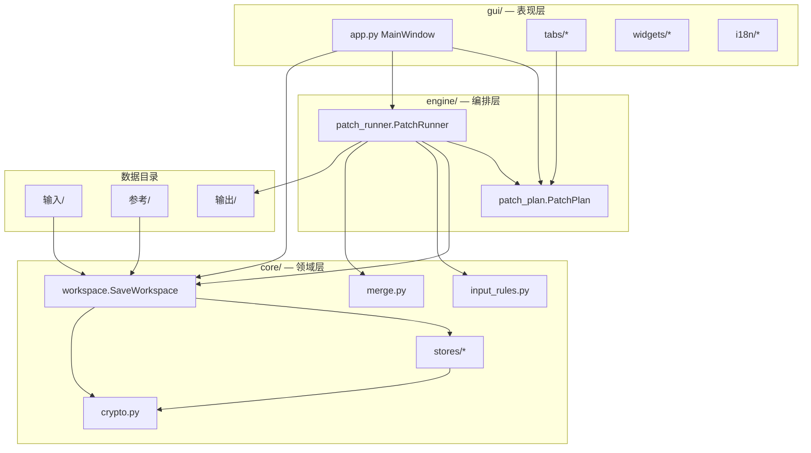

# 元气骑士存档编辑器 — 项目结构说明

> 版本：**v2 完整版** + **v3 武器系统**（获取次数）  
> 更新日期：2026-07-06  
> 入口：`python run.py`（GUI） / `python test_v2.py`（v2 验收） / `python test_v3.py`（v3 验收）

---

## 1. 项目定位

本地离线修改元气骑士（Soul Knight）存档的工具。核心原则：

| 原则 | 说明 |
|------|------|
| **扩展非替换** | 参考号合并只追加缺失项，不覆盖本号已有进度 |
| **输入输出分离** | 只读 `输入/`，写出到 `输出/`（每次应用清空重写） |
| **按需写出** | 仅输出本次修改涉及的分片，不复制未改动文件 |
| **Legacy 强制** | 改动物品时自动写 `OpenRijTest=0` 及 setting 开关 |
| **gems 只读** | 不读写 `game.data.gems`，不同步 XML 宝石键 |

**明确不做**：`*.data.new` / Rijndael 加密、云存档绕过、战令/赛季/成就全量编辑、gems 同步。

---

## 2. 目录树

```
存档编辑器/
├── run.py                      # GUI 入口
├── test_v2.py                  # v2 集中验收（含 v1 回归）
├── test_v3.py                  # v3 武器获取次数验收
├── requirements.txt            # 依赖
├── README.txt                  # 快速使用说明
├── plan-v2.md                  # v2 扩展计划
├── plan-v3.md                  # v3 武器系统计划
├── PROGRESS-v2.md              # v2 实施进度
├── PROGRESS-v3.md              # v3 实施进度
├── 结构.md                     # 本文档
│
├── 输入/                       # 待修改存档（只读来源）
├── 输出/                       # 应用结果（每次清空重写）
├── 参考/                       # 全满号参考档（仅 union 合并用）
│
├── core/                       # 核心业务层
│   ├── constants.py            # 路径常量、业务常量
│   ├── crypto.py               # 统一加解密
│   ├── workspace.py            # 存档工作台（载入/快照/克隆）
│   ├── shard_registry.py       # 分片类型注册表
│   ├── input_rules.py          # 输入审计 + 输出清单
│   ├── merge.py                # 增量合并策略
│   ├── reference_diff.py       # 本号 vs 参考号差异摘要
│   ├── diff.py                 # 变更预览工具
│   ├── deploy.py               # 部署前检查清单
│   ├── pet_map.py              # 宠物名 ↔ XML 索引映射
│   ├── weapon_util.py          # 【v3】武器 ID / 蓝图键解析
│   └── stores/                 # 各分片数据 Store
│       ├── base_shard_store.py
│       ├── game_store.py
│       ├── item_store.py
│       ├── prefs_store.py
│       ├── statistic_store.py  # 【v3】statistic 武器获取次数
│       └── weapon_evolution_store.py
│
├── engine/                     # 补丁执行引擎
│   ├── patch_plan.py           # 补丁计划（PatchPlan 数据类）
│   └── patch_runner.py         # 校验 / 预览 / 应用 / 写出
│
├── gui/                        # PySide6 图形界面
│   ├── app.py                  # 主窗口、Tab 编排、应用流程
│   ├── styles.py               # 全局 QSS 样式
│   ├── tabs/                   # 功能 Tab 页
│   │   ├── settings_tab.py     # 设置（路径与规则说明）
│   │   ├── heroes_skins_tab.py # 角色 / 皮肤
│   │   ├── pets_tab.py         # 宠物
│   │   ├── garden_tab.py       # 花圃（盆位 + plants）
│   │   ├── room_tab.py         # 客厅（设施等级 + 秘密钥匙）
│   │   ├── materials_tab.py    # 材料 / 种子 / 蓝图（含武器蓝图）
│   │   ├── weapons_tab.py      # 【v3】武器获取次数（仅 statistic）
│   │   └── inspect_tab.py      # 分片只读浏览
│   ├── widgets/                # 可复用 UI 组件
│   │   ├── stat_card.py
│   │   ├── status_board.py
│   │   ├── path_row.py
│   │   ├── info_panel.py
│   │   ├── item_catalog.py
│   │   ├── table_section.py
│   │   ├── table_style.py
│   │   ├── flow_layout.py
│   │   └── scroll_tab.py
│   └── i18n/                   # 国际化与实体显示名
│       ├── strings.json        # UI 文案 + entities 键名映射
│       ├── loader.py           # tr() / entity_name()
│       ├── workspace_fmt.py    # 工作台摘要格式化
│       └── audit_fmt.py
│
└── scripts/                    # 辅助脚本
    ├── prune_input.py          # 精简输入目录为最小文件集
    └── sync_entities.py        # 从样本收集键名写入 strings.json
```

**测试输出目录**（可忽略）：`_test_v2_output/`、`_test_v3_output/`、`_test_preset_output/`

**历史资料**：上级目录 `历史归档/`（v1 残留、分析脚本、原始样本等，不参与 v2 运行）

---

## 3. 架构分层



### 数据流（应用补丁）

```
输入/ + 参考/
    ↓ SaveWorkspace.load()
WorkspaceSnapshot（GUI 绑定）
    ↓ 各 Tab 收集用户选择
PatchPlan（补丁计划）
    ↓ PatchRunner.validate() / preview() / apply()
clone_for_patch() → _execute_plan()（内存修改）
    ↓ manifest_for_plan() 决定写出列表
输出/（加密写回 + JSON 调试副本 + 部署说明）
```

---

## 4. 核心模块详解

### 4.1 `core/constants.py`

全局路径与业务常量：

| 常量 | 值 / 含义 |
|------|-----------|
| `INPUT_DIR` | `存档编辑器/输入` |
| `OUTPUT_DIR` | `存档编辑器/输出` |
| `REF_DIR` | `存档编辑器/参考` |
| `PREFS_NAME` | `com.ChillyRoom.DungeonShooter.v2.playerprefs.xml` |
| `PLANT_POT_SLOTS` | `[3, 4, 5, 6, 7]` 花圃盆位 |
| `DEFAULT_LEVEL` | `7` 一键角色等级 |
| `MAX_QUANTITY` | `99999` 材料/种子数量上限 |
| `WEAPON_FORGE_UNLOCK_PLUS` | `8` 一键「常规武器锻造」获取次数增量 |
| `DEFAULT_WEAPON_RESEARCH_COUNT` | `2` 研究阈值参考值（文档用） |

### 4.2 `core/crypto.py`

统一加解密，对称于分析脚本 `analyze_data.py`：

| 分片类型 | 算法 | 写出函数 |
|----------|------|----------|
| `game.data` | XOR（SKD Convert） | `encrypt_game_data()` |
| `item_data` / `setting` / `season_data` / `task` | DES-iambo（SKD） | `encrypt_item_data()` / `encrypt_setting_data()` |
| `weapon_evolution_data` / `bp_data` / `pvp_data` 等 | DES-iambo（纯 DES） | `encrypt_shard_data()` |
| `statistic` | DES-crst1 | `encrypt_statistic()` |
| `sandbox_*` | 明文 | 直接读写 |

依赖：`soul-knight-data-processing`（SKD）、`pycryptodome`（DES）。

### 4.3 `core/shard_registry.py`

分片类型注册中心：

- **可写分片**：`item_data`、`weapon_evolution_data`、`setting`、`statistic`（v3：仅武器获取次数子树）
- **只读检视分片**：`bp_data`、`season_data`、`task`、`pvp_data`、`monsrise_data`、`misc_data`、`mall_reload_data`、`battles`、`sandbox_config`、`sandbox_maps`
- 工具函数：`shard_filename()`、`discover_shard_path()`

文件名模式：`{data_type}_{UID}_.data`（`game.data` 例外）。

### 4.4 `core/workspace.py`

**SaveWorkspace** 是存档操作的中心对象：

| 职责 | 说明 |
|------|------|
| 载入 | 解密必备文件 + 懒发现可选分片 |
| 参考加载 | 从 `参考/` 按 UID 加载 `item_data`、`weapon_evolution_data`、`statistic` |
| 快照 | 生成 `WorkspaceSnapshot` 供 GUI 绑定 |
| 检视缓存 | `load_inspect_shard()` 按需解密只读分片 |
| 克隆 | `clone_for_patch()` 深拷贝后供 Runner 修改，不污染原载入状态 |

**WorkspaceSnapshot** 关键字段：`uid`、`game_summary`、`item_snapshot`、`weapon_evolution_snapshot`、`statistic_snapshot`、`ref_weapon_used_times`、`statistic_loaded`、`shard_summaries`、`warnings`、`ref_diff_lines`、`skin_data`、`hero_data`、`pet_data`、`room_object_levels`、参考数据等。

### 4.5 `core/stores/` — 分片 Store

| Store | 文件 | 职责 |
|-------|------|------|
| `GameDataStore` | `game_store.py` | 角色/皮肤/宠物、客厅设施、秘密钥匙、`itemData` 镜像同步 |
| `ItemDataStore` | `item_store.py` | 花圃、材料/种子/蓝图、参考 merge（神话武器/锻造/饰品/装修等） |
| `PlayerPrefsStore` | `prefs_store.py` | XML 解析/写出、角色皮肤宠物双轨、Legacy 开关、UID 清理 |
| `WeaponEvolutionStore` | `weapon_evolution_store.py` | 武器进化参考 union + Level max |
| `StatisticStore` | `statistic_store.py` | `_weaponUsedTimes` 读写、`apply_weapon_used_plus(+8)`、参考 union |
| `BaseShardStore` | `base_shard_store.py` | 通用分片 load/save 模板（DES 写出） |

**双轨同步规则**（修改后必写文件）：

| 修改内容 | 写出文件 |
|----------|----------|
| 角色 / 皮肤 / 宠物 | `game.data` + `playerprefs.xml` |
| 花圃 / 材料 / 蓝图 / 神话武器等 | `item_data` + `game.data.itemData` 镜像 + `xml`（Legacy）+ 可选 `setting` |
| 武器进化 | 仅 `weapon_evolution_data` |
| 武器获取次数（v3） | 仅 `statistic_{UID}_.data` |
| 客厅设施 / 秘密钥匙 | 仅 `game.data` |

`ITEM_MIRROR_FIELDS`（item → game 同步字段）：`itemUnlock`、`materials`、`seeds`、`blueprints`、`plants`、`mythicWeapons`、`forgeWeapons`、`jewelryData`、`jewelryBlueprints`、`roomDecorateDic`、`roomDecorateCurSkinDic`。

### 4.6 `core/merge.py`

增量合并策略库：

| 函数 | 策略 |
|------|------|
| `append_unique_list` | 列表追加去重 |
| `dedupe_preserve_order` | itemUnlock 去重 |
| `union_dict` | 字典键 union |
| `union_materials` | 材料 union / 可选 max |
| `union_mythic_weapons` | 神话武器按 id union |
| `append_forge_weapons` | 锻造武器 append |
| `union_weapons_dict` | 武器进化字典 union + Level max |

### 4.7 `core/input_rules.py`

| 类型 | 职责 |
|------|------|
| `InputAudit` | 扫描输入目录：必备/可选/垃圾/冗余/缺失 |
| `OutputManifest` | 根据 `PatchPlan.touches_*()` 决定输出文件列表 |
| `audit_input()` | 输入目录健康检查 |
| `manifest_for_plan()` | 生成输出清单 |

### 4.8 `core/reference_diff.py`

计算本号相对参考号将新增的数量（蓝图、种子、材料、神话武器、锻造武器、itemUnlock、武器进化），供工作台差异预览。

---

## 5. 引擎层

### 5.1 `engine/patch_plan.py` — PatchPlan

补丁计划数据类，所有 Tab 和工作台勾选最终汇聚为一个 `PatchPlan`：

**一键预设**

| 字段 | 含义 |
|------|------|
| `all_characters` | 全角色解锁 + 等级 + 技能 |
| `all_skins` | 全皮肤 |
| `all_pets` | 全宠物 |
| `plant_pots` | 花圃槽位 3~7 |
| `unlock_weapon_forge` | 【v3】常规武器锻造：已有武器获取次数各 +8 |
| `cleanup_stale_uid` | 清理 XML 中他号 UID 键 |
| `default_level` | 一键等级（默认 7） |

**参考合并**

| 字段 | 含义 |
|------|------|
| `merge_blueprints` | union 蓝图 |
| `merge_seeds` | union 种子 |
| `merge_item_unlock` | append itemUnlock |
| `merge_mythic_weapons` | union 神话武器 |
| `merge_materials` / `merge_materials_max` | union 材料 / 可选 max |
| `merge_forge_weapons` | append 锻造武器 |
| `merge_jewelry` | union 饰品 |
| `merge_room_decorate` | union 客厅装修 |
| `merge_weapon_evolution` / `merge_weapon_evolution_max` | union 武器进化 / Level max |
| `merge_weapon_used_times` / `merge_weapon_used_max` | 【v3】union 武器获取次数 / 可选 max |

**细调 picks**

| 字段 | 含义 |
|------|------|
| `hero_picks` / `skin_picks` / `pet_picks` | 角色/皮肤/宠物自选 |
| `plant_picks` | 花圃植物槽编辑 |
| `item_unlock_picks` / `item_unlock_append` | itemUnlock 勾选/追加 |
| `material_picks` / `seed_picks` / `blueprint_picks` | 数量/蓝图编辑（蓝图含武器类，在材料 Tab） |
| `weapon_used_picks` | 【v3】单武器获取次数（武器 Tab 勾选行） |
| `room_object_levels` | 客厅设施等级 |
| `secret_keys_append` | 秘密房间钥匙追加 |

**控制开关**：`force_legacy_format`（默认 true）、`sync_item_mirror`（默认 true）。

**touches_*() 方法**：判断计划是否触及 `game` / `prefs` / `item` / `setting` / `weapon_evolution` / `statistic`（v3），驱动输出清单。

### 5.2 `engine/patch_runner.py` — PatchRunner

| 方法 | 职责 |
|------|------|
| `validate(plan)` | 检查输入完备性、参考目录是否满足 merge 需求 |
| `preview(plan)` | 克隆后执行计划，返回变更摘要（不写盘） |
| `apply(plan)` | 校验 → 执行 → 清空输出目录 → 加密写出 → 写部署说明 |
| `_execute_plan()` | 按顺序调用各 Store 的 patch/merge 方法 |

**输出产物**：

```
输出/
├── game.data
├── game.data.json              # 调试可读副本
├── com.ChillyRoom...xml
├── item_data_{UID}_.data
├── item_data_{UID}_.json
├── setting_{UID}_.data         # 若触及物品且输入有 setting
├── weapon_evolution_data_{UID}_.data
├── weapon_evolution_data_{UID}_.json
├── statistic_{UID}_.data         # 【v3】触及武器获取次数时
├── statistic_{UID}_.json
├── changes_preview.json        # 变更摘要
└── 部署说明.json               # 完整报告 + 部署清单
```

---

## 6. GUI 层

### 6.1 Tab 结构

```
┌──────────────────────────────────────────────────────────────────────────────┐
│ [工作台] [角色/皮肤] [宠物] [花圃] [客厅] [材料/种子] [武器] [浏览] [设置] [日志] │
└──────────────────────────────────────────────────────────────────────────────┘
         ↑ 底部全局操作栏：刷新载入 · 预览变更 · 应用并输出
```

| Tab | 模块 | 能力 |
|-----|------|------|
| **工作台** | `app._build_workspace_tab()` | 存档概览、统计卡片、输入/参考文件芯片、告警、一键预设、参考合并 10 项勾选 |
| **角色/皮肤** | `heroes_skins_tab.py` | 按角色筛选，勾选解锁/等级/技能/皮肤；与一键互斥（一键优先） |
| **宠物** | `pets_tab.py` | 宠物解锁勾选 |
| **花圃** | `garden_tab.py` | 盆位 itemUnlock、plants 表格编辑（plantName/state/watered/fertilized） |
| **客厅** | `room_tab.py` | `roomObjectLevel` 设施等级、秘密钥匙追加 |
| **材料/种子** | `materials_tab.py` | 材料/种子数量表、**全部蓝图**（含武器蓝图）Got 勾选 |
| **武器** | `weapons_tab.py` | 【v3】仅 `statistic._weaponUsedTimes` 表格编辑；蓝图不在此 Tab |
| **浏览** | `inspect_tab.py` | 解密展示 statistic/bp/season 等只读分片（输入有则显示） |
| **设置** | `settings_tab.py` | 输入/输出/参考路径、文件放置规则、部署说明 |
| **日志** | `app._build_log_tab()` | 预览/应用过程实时日志 |

### 6.2 主流程（`gui/app.py`）

1. **刷新载入**：`SaveWorkspace.load()` → 更新各 Tab `bind_*()` → 显示快照
2. **预览变更**：`_build_plan()` → `PatchRunner.preview()` → 弹窗 + 写日志
3. **应用并输出**：确认编码值材料 → `PatchWorker` 后台线程 → `PatchRunner.apply()`

`PatchWorker`（QThread）避免 UI 阻塞；应用前对编码值材料做二次确认。

### 6.3 国际化（`gui/i18n/`）

- `strings.json`：`ui` 段为界面文案，`entities` 段为游戏内键名 → 中文显示名
- `loader.tr(key)` / `loader.entity_name(key)`：Tab 与表格列标题使用
- `workspace_fmt.py`：工作台摘要、文件芯片、告警行格式化

### 6.4 UI 组件（`gui/widgets/`）

| 组件 | 用途 |
|------|------|
| `StatCard` | 顶部 UID/角色/皮肤/宠物/宝石统计卡 |
| `KeyValueGrid` / `ChipRow` / `NoticeList` | 工作台概览区 |
| `PathRow` | 设置页目录路径行 |
| `InfoPanel` | 设置页说明面板 |
| `TableSection` + `table_style` | 材料/花圃等表格区 |
| `item_catalog` | 物品键排序（已拥有优先） |

---

## 7. 输入 / 输出规范

### 7.1 输入目录 `输入/`

| 类别 | 文件 | 说明 |
|------|------|------|
| **必备** | `game.data` | 主存档 |
| **必备** | `com.ChillyRoom.DungeonShooter.v2.playerprefs.xml` | PlayerPrefs |
| **按需** | `item_data_{UID}_.data` | 改花圃/材料/蓝图/参考合并时需要 |
| **可选** | `setting_{UID}_.data` | 改动物品时同步 Legacy 开关 |
| **可选** | `weapon_evolution_data_{UID}_.data` | 武器进化合并/写出时需要 |
| **按需** | `statistic_{UID}_.data` | 【v3】改武器获取次数 / 一键 +8 时需要 |

**不要放入**：bp/task/season 等**未修改**且本次不写的分片、无 UID 冗余副本（`item_data.data`）、bugly 等无关文件。

### 7.2 参考目录 `参考/`

仅 **union 合并** 时使用。需含参考号的 `playerprefs.xml` 及对应 `item_data` / `weapon_evolution_data`（按参考号 UID 匹配）。

### 7.3 输出目录 `输出/`

- 每次「应用并输出」**清空后重写**
- 只包含本次 `PatchPlan` 触及的文件
- 附带 `部署说明.json`（含 `deploy_checklist`）和 `changes_preview.json`

---

## 8. 可写分片与字段映射

| 分片 | Store | 主要可编辑字段 | GUI 入口 |
|------|-------|----------------|----------|
| `game.data` | GameDataStore | `heroUnlock/Level/Skill`、`skinLock`、`petUnlock`、`roomObjectLevel`、`usedSecretKeys`、`itemData` 镜像 | 角色/皮肤、宠物、花圃、客厅、工作台 |
| `playerprefs.xml` | PlayerPrefsStore | 角色/皮肤/宠物 XML 双轨、`OpenRijTest`、UID 清理 | 角色/皮肤、宠物、工作台 |
| `item_data` | ItemDataStore | `itemUnlock`、`materials`、`seeds`、`blueprints`、`plants`、`mythicWeapons`、`forgeWeapons`、饰品/装修 | 花圃、材料/种子、工作台 merge |
| `setting` | 直接写 | `UseRijData`、`UseNewtonJsonData` | 随物品修改自动 |
| `weapon_evolution_data` | WeaponEvolutionStore | `weapons` 字典 | 工作台 merge |
| `statistic` | StatisticStore | `StatisticsData.WeaponGameStatisticData._weaponUsedTimes` | 武器 Tab、工作台一键 +8 |

**只读检视**（`inspect_tab`）：`bp_data`、`season_data`、`task`、`pvp_data` 等 — 解密浏览；`statistic` 在浏览 Tab 只读，在武器 Tab / 一键 +8 时可写出。

### 8.1 v3 武器打造数据链

```
地牢获取次数  statistic._weaponUsedTimes     ← v3 可写（武器 Tab / 一键 +8）
      ↓
研究蓝图      item_data.blueprints             ← 材料 Tab（与武器 Tab 分离）
      ↓
锻造产出      item_data.forgeWeapons          ← 工作台参考 merge append
```

一键 **「常规武器锻造（获取次数 +8）」**：对 statistic 中**已有记录**的每个 `weapon_*` 键，现值 +8；仅输出 `statistic_{UID}_.data`，不改 `item_data`。

---

## 9. 测试

| 脚本 | 用途 |
|------|------|
| `test_v2.py` | v2 完整验收 |
| `test_v3.py` | v3 武器：statistic 写出、+8 预设、参考 union 次数、仅 statistic 输出 |
| `test_full.py` | v1 回归（位于 `历史归档/存档编辑器-v1残留/`） |

测试使用目录：`输入/`、`参考/`；v2 → `_test_v2_output/`，v3 → `_test_v3_output/`。

**真实存档验收**（2026-07-06，UID `224082683`）：

- 输入：`game.data`、`playerprefs.xml`、`item_data`、`setting`、`weapon_evolution`、`statistic`
- 操作：`unlock_weapon_forge`（+8）
- 输出：仅 `statistic_224082683_.data`（DES-crst1 可解密）
- 抽样：`weapon_000xx12` 4→12，`weapon_001` 1→9；共 193 项 +8
- 输入目录未被修改

---

## 10. 依赖

```
soul-knight-data-processing   # SKD Convert，game/item/setting 加解密
PySide6>=6.6                  # GUI 框架
pycryptodome                  # DES 加解密（weapon_evolution 等分片）
```

安装：`pip install -r requirements.txt`

---

## 11. 辅助脚本

| 脚本 | 命令 | 作用 |
|------|------|------|
| `scripts/prune_input.py` | `python scripts/prune_input.py` | 删除输入目录中非必备文件，保留最小集 |
| `scripts/sync_entities.py` | `python scripts/sync_entities.py` | 从样本 item_data 收集键名，合并进 `strings.json` 的 `entities` |

---

## 12. 与外部资料关系

| 路径 | 关系 |
|------|------|
| `历史归档/分析输出/存档文件职责说明.md` | 各分片字段职责参考 |
| `历史归档/分析输出/` | 两账号对比数据来源 |
| `历史归档/脚本/analyze_data.py` | 分片解密分析（编辑器写出需可被其解密） |
| `plan-v2.md` | v2 功能 ID、阶段排期、验收标准 |
| `plan-v3.md` | v3 武器系统范围与阶段 |
| `PROGRESS-v2.md` | v2 实施完成状态 |
| `PROGRESS-v3.md` | v3 实施与真实存档验收 |

---

## 13. 扩展指南

新增可写分片的一般步骤：

1. 在 `shard_registry.SHARD_SPECS` 注册类型与加密方式
2. 新建 `core/stores/xxx_store.py`（可继承 `BaseShardStore`）
3. 在 `SaveWorkspace` 增加懒加载与快照字段
4. 在 `PatchPlan` 增加字段与 `touches_*()` 判断
5. 在 `PatchRunner._execute_plan()` 与写出逻辑中接入
6. 在 `manifest_for_plan()` 中登记输出
7. 可选：新增 GUI Tab 或扩展现有 Tab
8. 在 `test_v2.py` 增加验收用例

---

## 14. 快速命令

```bash
# 安装依赖
pip install -r requirements.txt

# 启动 GUI
python run.py

# 运行验收
python test_v2.py
python test_v3.py

# 精简输入目录
python scripts/prune_input.py
```